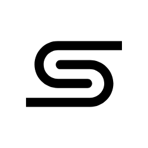

  
  <h1>SyNote</h1>
  
<strong>Simple. Elegant. Real-time.</strong>

  

    
    
    
    
    
  

---

**SyNote** is a minimalist, progressive web application (PWA) designed for seamless note-taking. Whether you're online or offline, your notes are always with you.

Unlike traditional note apps that require constant connectivity, SyNote leverages local storage and efficient compression to ensure your thoughts are captured instantly.

## 🚀 Why SyNote?

| Feature | SyNote | Google Keep |
| :--- | :--- | :--- |
| **Privacy** | 🔒 **High** (Guest mode local) | ☁️ **Medium** (Cloud Only) |
| **Math Support** | 🧮 **Native** (Inline Calculation) | ❌ **No** (Manual) |
| **Offline Use** | ✅ **Yes** (PWA Capable) | ✅ **Yes** (App Only) |
| **Search** | ⚡ **Instant** (Compressed Data) | 🔍 **Standard** |
| **Guest Mode** | 👤 **Yes** (No Login Req.) | ❌ **No** (Account Req.) |

## ✨ Key Features

*   **Real-time Synchronization**: 🔄 Powered by **Firebase Firestore**, notes sync instantly across devices.
*   **Guest Mode & Privacy**: 🕵️ Try it without signing in! Data is compressed with **LZ-String** and stored locally.
*   **Smart Math Integration**: 🧮 Type `25 * 4 =` and it automatically becomes `100`.
*   **Progressive Web App**: 📱 Install on desktop or mobile for a native, offline-capable experience.
*   **Beautiful UI/UX**:
    *   Dark Mode support.
    *   Responsive sidebar and layout.
    *   Instant client-side search.
*   **Secure**: 🔒 Authentication via Google or Email/Password.

## 📦 Tech Stack
This project uses the following technologies:
*   **HTML5 & Vanilla JS** (Frontend)
*   **Tailwind CSS** (Styling)
*   **Firebase** (Auth & Firestore)
*   **lz-string** (Compression)
*   **expr-eval** (Math)
*   **FontAwesome** (Icons)

## 📄 License
MIT License. Open source and free to use.

---

  Made with ❤️ by <a href="mailto:arunthomas04042001@gmail.com">Arun Thomas</a>

